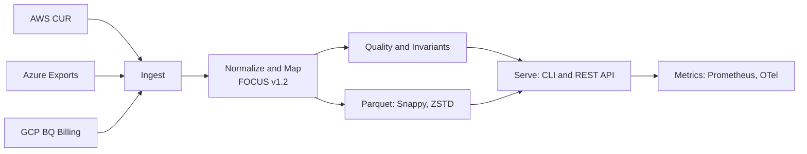

# CostScope — FinOps & Governance for AI/LLM and GPU workloads.

CostScope is an open FinOps and Governance platform that measures, allocates, and optimizes cloud, on‑prem, and AI/LLM GPU costs with full FOCUS 1.2 compatibility.

[](https://focus.finops.org)
[](https://github.com/costscope/costscope/actions/workflows/ci.yml)
[](https://goreportcard.com/report/github.com/costscope/costscope)
[](https://securityscorecards.dev/viewer/?uri=github.com/costscope/costscope)
[](LICENSE)

## Why CostScope

Cloud cost data is noisy and inconsistent. Before insights and optimization, you need a trustworthy data layer. CostScope is the high‑performance, open data plane that standardizes AWS, Azure, and GCP billing into the FinOps FOCUS format and makes it instantly usable across your analytics stack. In addition, the GenAI FinOps module (preview) extends CostScope to AI/LLM workloads by unifying usage and billing and tying spend to performance and energy for predictable costs.

## Key Features

- **FOCUS 1.2 Conversion** — Transform CURs, BQ, and CSV exports into a normalized FinOps schema.  
- **Multi‑Cloud + On‑Prem Support** — Works with AWS, GCP, Azure, and self‑hosted clusters.  
- **GPU & Energy Metrics (Kepler)** — Correlate energy use, GPU hours, and cost impact.  
- **Observability‑Ready** — Expose metrics via Prometheus / OpenTelemetry.  
- **AI/LLM Governance (Preview)** — Connect AI workloads to cost governance and policies.  
- **Integrity & Provenance** — SBOM, signatures, reproducible builds, and deterministic pipelines.

## Competitive Advantages

- **Extensible for AI FinOps** — Kepler‑based GPU metrics, Model‑to‑Metal allocation, and policy‑driven governance.  
- **Hybrid Ready** — Works both in cloud and on‑prem FinOps stacks.  
- **Standards‑Driven** — Native FOCUS 1.2 + OpenTelemetry metrics + signed artifacts.  
- **OSS First** — Open, transparent, and integrable with commercial FinOps tools.

## Screenshots & Examples

Below is a simplified view of the conversion pipeline. Add your own operational screenshots (metrics, validation reports) to the `docs/assets/` folder to enrich this section.


<details>
  <summary>Mermaid source (expand)</summary>



</details>

## Quick Start

Minimal steps to get from raw billing to a validated FOCUS file.

```bash
# 1) Download a release binary for your platform and make it executable
#    (see repository Releases page)
# linux example:
curl -L -o costscope "<release-binary-url>" && chmod +x costscope

# 2) Convert an AWS CUR (or Azure/GCP export) to FOCUS Parquet
./costscope convert --provider aws \
  --input ./aws-cur.csv.gz --output ./focus.parquet --streaming

# 3) Validate the output against FOCUS and quality checks
./costscope validate ./focus.parquet --all --output validation.json

# Optional) Start the Enterprise API with metrics enabled
export COSTSCOPE_JWT_SECRET="$(openssl rand -base64 48)"
./costscope enterprise --port 8080 &
curl -s http://localhost:8080/metrics | head -n 10
```

More examples and guides are in the docs.

## Architecture

```
Cloud Export / GPU Telemetry (Kepler)
        ↓
   Ingest → Normalize → Validate
        ↓
   FinOps FOCUS 1.2 Dataset
        ↓
  ┌────────────────────────────┐
  │  Dashboards / BI / SQL     │
  │  CostScope Backstage Plugin│
  │  CostScope GenAI FinOps    │ (extension)
  └────────────────────────────┘
```

---


## Documentation

Looking for deep dives, configuration, and API details? Start here:

[Full Documentation](docs/DOCUMENTATION_INDEX.md)

## Roadmap (Highlights)

| Area | Focus |
|------|--------|
| Core | FOCUS 1.2 ETL improvements, data validation |
| GPU/AI | Kepler exporter, AI metrics correlation |
| Governance | RuleHub policies integration, alerts, budgets |
| Visualization | Backstage plugin, Grafana dashboards |

## Contributing

We welcome issues and PRs. Please read the CONTRIBUTING.md to get started.

## License

MIT — see LICENSE.
