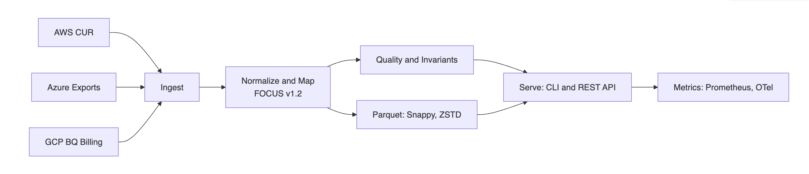
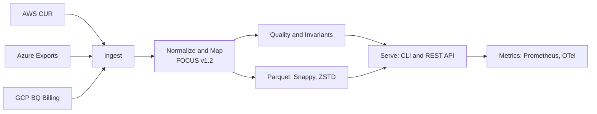

# CostScope — Open FinOps Data Plane

Turn raw cloud billing exports into a clean, analytics‑ready FinOps FOCUS dataset. Fast. Reliable. Open.

[](https://focus.finops.org)
[](LICENSE)

---

## Why CostScope

Cloud cost data is noisy and inconsistent. Before insights and optimization, you need a trustworthy data layer. CostScope is the high‑performance, open data plane that standardizes AWS, Azure, and GCP billing into the FinOps FOCUS format and makes it instantly usable across your analytics stack.

## Highlights

- Multi‑cloud to one standard: AWS CUR, Azure, GCP → FOCUS v1.2
- Streaming at scale: processes very large files with a stable, low‑memory footprint
- Quality you can trust: invariants and validation to prevent data drift
- Analytics‑ready output: compressed Parquet for DuckDB, warehouses, and BI
- One binary, two modes: powerful CLI and production‑grade REST API
- Built‑in visibility: Prometheus metrics and OpenTelemetry tracing

## Competitive Advantages

- Time to value: from raw exports to a validated FOCUS dataset in minutes
- No lock‑in: open standards and open source — your data stays yours
- Operational simplicity: a single efficient binary instead of bespoke ETL
- Designed for reliability: data quality guardrails by default
- Performance at scale: streaming architecture for terabyte‑class workloads

## Screenshots & Examples

Below is a simplified view of the conversion pipeline. Add your own operational screenshots (metrics, validation reports) to the `docs/assets/` folder to enrich this section.



<details>
  <summary>Mermaid source (expand)</summary>



</details>


## Quick Start

Minimal steps to get from raw billing to a validated FOCUS file.

```bash
# 1) Download a release binary for your platform and make it executable
#    (see repository Releases page)
# linux example:
curl -L -o costscope "<release-binary-url>" && chmod +x costscope

# 2) Convert an AWS CUR (or Azure/GCP export) to FOCUS Parquet
./costscope convert --provider aws \
  --input ./aws-cur.csv.gz --output ./focus.parquet --streaming

# 3) Validate the output against FOCUS and quality checks
./costscope validate ./focus.parquet --all --output validation.json

# Optional) Start the Enterprise API with metrics enabled
export COSTSCOPE_JWT_SECRET="$(openssl rand -base64 48)"
./costscope enterprise --port 8080 &
curl -s http://localhost:8080/metrics | head -n 10
```

More examples and guides are in the docs.

## Documentation

Looking for deep dives, configuration, and API details? Start here:

[Full Documentation](docs/DOCUMENTATION_INDEX.md)

## Contributing

We welcome issues and PRs. Please read the CONTRIBUTING.md to get started.

## License

Apache 2.0 — see LICENSE.
