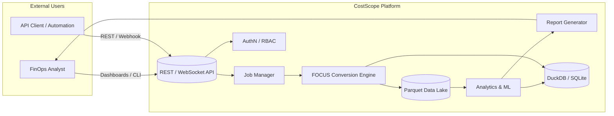

# CostScope Architecture Documentation

> Legend:
> [API LAYER] external interface; [CORE MODULES] domain feature sets; [CORE SERVICES] cross-cutting foundational services; [DATA LAYER] persistence & analytical stores; [CLOUD PROVIDERS] ingestion sources.
> Diagrams use bracketed tags instead of emojis for portability.


## System Overview

CostScope is a modern, cloud-native cost management platform built with Go, designed for enterprise-scale FOCUS (FinOps Open Cost and Usage Specification) operations. The architecture follows microservices principles with modular design, high performance, and production-ready scalability.

## Design Principles

### 1. **Modularity**
- Independent, loosely coupled modules
- Clear separation of concerns
- Plugin-based provider architecture

### 2. **Performance**
- High-throughput data processing
- Memory-optimized algorithms
- Concurrent processing with Go routines

### 3. **Scalability**
- Horizontal scaling support
- Distributed processing capabilities
- Cloud-native deployment patterns

### 4. **Reliability**
- Comprehensive error handling
- Health monitoring and alerting
- Graceful degradation

### 5. **Security**
- JWT-based authentication
- Role-based access control (RBAC)
- Comprehensive audit logging

## High-Level Architecture

```
┌─────────────────────────────────────────────────────────────────┐
│                     CostScope Platform                          │
├─────────────────────────────────────────────────────────────────┤
│  [API LAYER]                                                    │
│  ├── Authentication & Authorization (JWT + RBAC)                │
│  ├── Rate Limiting & Security Middleware                        │
│  └── OpenAPI Documentation & Monitoring                         │
├─────────────────────────────────────────────────────────────────┤
│  [CORE MODULES]                                                 │
│  ├── FOCUS Operations        ├── Advanced Analytics            │
│  ├── Provider Management     ├── Reports Generation            │
│  ├── Streaming Operations    ├── System Monitoring             │
│  ├── Integration Hub         └── Production Assessment         │
├─────────────────────────────────────────────────────────────────┤
│  [CORE SERVICES]                                                │
│  ├── Configuration Management    ├── Logging & Audit           │
│  ├── Job Manager & Scheduling    ├── Persistence Layer         │
│  └── WebSocket Management        └── Memory Optimization       │
├─────────────────────────────────────────────────────────────────┤
│  [DATA LAYER]                                                   │
│  ├── DuckDB (Analytics Engine)   ├── SQLite (Metadata)         │
│  ├── File System (Parquet/CSV)   └── Memory Cache              │
├─────────────────────────────────────────────────────────────────┤
│  [CLOUD PROVIDERS]                                              │
│  ├── AWS (Cost Explorer, CUR)    ├── Azure (Cost Management)   │
│  └── GCP (BigQuery Billing)      └── Multi-Cloud Operations    │
└─────────────────────────────────────────────────────────────────┘
```

## C4 Diagrams

### System Context


### Container View
```mermaid
graph TB
   Client[CLI / External Clients]
   LB[API Server (Go)]
   Worker[Background Workers]
   Conv[Conversion Module]
   Stream[Streaming Processor]
   Analytic[Analytics Engine]
   Report[Reporting Module]
   Auth[Auth & RBAC]
   DuckDB[(DuckDB)]
   SQLite[(SQLite Metadata)]
   Parquet[(Parquet Files)]

   Client --> LB
   LB --> Auth
   LB --> Worker
   Worker --> Conv
   Worker --> Stream
   Conv --> Parquet
   Stream --> Parquet
   Conv --> DuckDB
   Analytic --> DuckDB
   Analytic --> Parquet
   Report --> DuckDB
   Report --> Parquet
   LB --> Analytic
   LB --> Report
   LB --> SQLite
   Auth --> SQLite
```

### Component (FOCUS Conversion)
```mermaid
graph LR
   In[Input Files (CUR / Usage / Billing)] --> Parser[Provider Parser]
   Parser --> Mapper{Mapper\n  (Previous or Unified)}
   Mapper --> Normalizer[Field Normalizer (unified path)]
   Normalizer --> Validator[Schema & Quality Validator]
   Validator --> Writer[Parquet Writer & Rotator]
   Writer --> Out[(Parquet Output)]
   Mapper -->|metrics| Metrics[(Prometheus)]
   Writer -->|spans| Tracing[(OTel)]
```


## Project Structure

```
costscope/
├── cmd/                          # Command-line interfaces
│   ├── main.go                   # Application entry point
│   ├── root.go                   # Root command setup
│   └── modules/                  # Module-specific commands
│       ├── analytics/            # Analytics CLI commands
│       ├── api/                  # API server commands
│       ├── focus/                # FOCUS operations
│       ├── providers/            # Provider management
│       └── ...                   # Other modules
├── internal/                     # Internal packages
│   ├── api/                      # REST API implementation
│   │   ├── handlers/             # HTTP handlers
│   │   ├── middleware/           # Security & middleware
│   │   ├── websocket/            # WebSocket management
│   │   └── jobs/                 # Async job management
│   ├── core/                     # Core business logic
│   │   ├── analytics/            # ML & analytics engine
│   │   ├── config/               # Configuration management
│   │   ├── focus/                # FOCUS operations
│   │   ├── logging/              # Structured logging
│   │   ├── persistence/          # Data persistence
│   │   ├── reports/              # Report generation
│   │   └── streaming/            # Real-time processing
│   ├── database/                 # Database adapters
│   │   ├── duckdb/               # DuckDB integration
│   │   ├── performance/          # Performance optimization
│   │   └── types/                # Database types
│   ├── providers/                # Cloud provider integrations
│   │   ├── aws/                  # AWS integration
│   │   ├── azure/                # Azure integration
│   │   ├── gcp/                  # GCP integration
│   │   └── types/                # Provider interfaces
│   └── optimization/             # Performance optimization
├── docs/                         # Documentation
├── configs/                      # Configuration files
├── scripts/                      # Build & deployment scripts
└── tests/                        # Test suites
```

## Data Flow Architecture
## Framework Architecture (Integrated Summary)

The internal framework (dependency injection container, event bus, plugin loader, lifecycle manager, enhanced CLI command discovery) underpins modular extensibility:

- DI Container: named singleton & factory registrations with struct tag injection.
- Event Bus: subscribe / subscribeOnce / emit with lightweight in-process dispatcher.
- Plugin Loader: built-in + (future) external plugin discovery; ordered initialization via priority.
- Lifecycle Manager: start/stop sequencing with health signals.
- Enhanced CLI: auto-discovery of command providers injecting framework context.

Key Interfaces:


```bash
Plugin{Name(), Version(), Initialize(ctx, container), Start(ctx), Stop(ctx), Health()}
```


```bash
CommandProvider{Priority(), GetCommands() []*cobra.Command}
```

Common Workflow:
1. Framework start builds container and loads plugins.
2. CLI auto-discovers providers and registers commands.
3. Event-driven modules emit domain events (e.g. cost analysis completion) for decoupled consumers.

Performance Targets: plugin load <100ms, event throughput 10k+/s, DI resolution <1ms.

Future Enhancements: external plugin loading (Go plugins or gRPC shim), hot-reload, advanced config validation, Prometheus export of framework internals.

### 1. **Data Ingestion Flow**
```
Cloud Provider → Raw Billing Data → FOCUS Conversion → Standardized Data → Analytics
     ↓               ↓                      ↓                    ↓              ↓
   AWS CUR      CSV/JSON Files        Parquet Files        DuckDB         Insights
   Azure CE     Usage Reports         FOCUS Schema         SQLite         Reports
   GCP Export   BigQuery Export       Validation          Memory         Forecasts
```

### 2. **Processing Pipeline**
```
┌─────────────────┐    ┌─────────────────┐    ┌─────────────────┐    ┌─────────────────┐
│   Data Source   │───▶│  FOCUS Convert  │───▶│   Analytics     │───▶│    Reports      │
│                 │    │                 │    │                 │    │                 │
│ • AWS CUR       │    │ • Schema Map    │    │ • ML Models     │    │ • PDF/Excel     │
│ • Azure Export  │    │ • Validation    │    │ • Forecasting   │    │ • JSON/CSV      │
│ • GCP Billing   │    │ • Optimization  │    │ • Anomalies     │    │ • Dashboards    │
└─────────────────┘    └─────────────────┘    └─────────────────┘    └─────────────────┘
```

### 3. **Real-time Streaming**
```
┌─────────────────┐    ┌─────────────────┐    ┌─────────────────┐    ┌─────────────────┐
│ Streaming Data  │───▶│  Job Manager    │───▶│   Processing    │───▶│  Live Updates   │
│                 │    │                 │    │                 │    │                 │
│ • S3 Events     │    │ • Scheduling    │    │ • Batch Proc    │    │ • WebSocket     │
│ • API Hooks     │    │ • Queue Mgmt    │    │ • Stream Proc   │    │ • Notifications │
│ • File Uploads  │    │ • Workers       │    │ • Aggregation   │    │ • Dashboard     │
└─────────────────┘    └─────────────────┘    └─────────────────┘    └─────────────────┘
```

## Core Components

### 1. **API Layer** (`internal/api/`)

**Responsibility**: External interface and communication

**Components**:
- **REST Handlers** (`handlers/`): HTTP endpoint implementations
- **WebSocket Manager** (`websocket/`): Real-time communication
- **Middleware** (`middleware/`): Security, logging, rate limiting
- **Job Manager** (`jobs/`): Async operation management

**Key Features**:
- JWT & API key authentication
- Role-based access control
- Rate limiting & CORS
- OpenAPI documentation
- Real-time progress updates

### 2. **Core Services** (`internal/core/`)

**Responsibility**: Business logic and core functionality

**Components**:
- **Analytics Engine** (`analytics/`): ML-powered cost analysis
- **FOCUS Operations** (`focus/`): FOCUS spec implementation
- **Configuration** (`config/`): Dynamic configuration management
- **Logging** (`logging/`): Structured logging system
- **Persistence** (`persistence/`): Data storage abstraction
- **Reports** (`reports/`): Report generation engine
- **Streaming** (`streaming/`): Real-time data processing

### 3. **Provider Integration** (`internal/providers/`)

**Responsibility**: Cloud provider connectivity

**Architecture**:
```
┌─────────────────┐
## Development Architecture

### Compact Module Pattern
```
┌──────── Module Structure ────────┐
│ commands/ types/ handlers/      │
│ internal/ (impl)                │
├──── Testing & Docs ─────────────┤
│ unit | integration | e2e | perf │
│ README | API | Examples | T/S   │
└─────────────────────────────────┘
```

## Split Reference (Modular Architecture Sections)
These dedicated documents provide deeper focus:

| Section | File |
|---------|------|
| API Layer | `api-layer.md` |
| Core Services | `core-services.md` |
| Data Layer | `data-layer.md` |
| Security Model | `security-model.md` |
| Performance | `../dev/performance-benchmarks.md` |
| Deployment | `deployment.md` |
| Monitoring & Observability | `monitoring.md` |

## Cross-Document Links
- `../ops/production-deployment.md`
- `../ops/logging.md`
- `../ops/monitoring/monitoring-overview.md`
- `../security/supply-chain.md`
- `../release/checklist.md`
- `../support/faq.md`
├─────────────────────────────────────────────────────────────────┤
(_Logical grouping for observability, notifications, orchestration_)
│  ├── Email (Reports)                                           │
│  ├── Teams (Alerts)                                            │
│  └── PagerDuty (Incidents)                                     │
├─────────────────────────────────────────────────────────────────┤
│  ├── REST APIs (Bidirectional)                                 │
│  ├── File Exports (Scheduled)                                  │
│  └── Database Sync (ETL)                                       │
└─────────────────────────────────────────────────────────────────┘
```

## Performance Architecture

### Performance Optimization Strategies

1. **Memory Management**
   - Streaming data processing
   - Garbage collection optimization
   - Memory pool allocation
   - Resource monitoring

2. **Concurrency**
   - Go routine pools
   - Channel-based communication
   - Lock-free algorithms
   - Context-based cancellation

3. **Caching**
   - In-memory result cache
   - Query result caching
   - Configuration caching
   - Provider data caching

4. **Database Optimization**
   - Columnar storage (Parquet)
   - Query optimization
   - Index strategies
   - Connection pooling

### Scalability Patterns
```
┌─────────────────────────────────────────────────────────────────┐
│                  Horizontal Scaling                             │
├─────────────────────────────────────────────────────────────────┤
│  [LOAD BALANCING]                                              │
│  ├── API Gateway (NGINX/Kong)                                  │
│  ├── Health Check Endpoints                                    │
│  └── Circuit Breaker Pattern                                   │
├─────────────────────────────────────────────────────────────────┤
│  [CONTAINER ORCHESTRATION]                                     │
│  ├── Docker Containers                                         │
│  ├── Kubernetes Deployment                                     │
│  ├── Auto-scaling Policies                                     │
│  └── Resource Limits                                           │
├─────────────────────────────────────────────────────────────────┤
│  [DATA PARTITIONING]                                          │
│  ├── Time-based Partitioning                                   │
│  ├── Provider-based Sharding                                   │
│  ├── Account-based Isolation                                   │
│  └── Geographic Distribution                                   │
└─────────────────────────────────────────────────────────────────┘
```

## Development Architecture

### Module Development Pattern
```

---
## See also
- `../ops/production-deployment.md`
- `../ops/logging.md`
- `../security/supply-chain.md`
- `../release/checklist.md`
- `../support/faq.md`
┌─────────────────────────────────────────────────────────────────┐
│                   Module Structure                              │
├─────────────────────────────────────────────────────────────────┤
│  [MODULE DIRECTORY]                                            │
│  ├── commands/           # CLI command definitions             │
│  ├── types/              # Module-specific types               │
│  ├── handlers/           # HTTP handlers (if applicable)       │
│  └── internal/           # Internal implementation             │
├─────────────────────────────────────────────────────────────────┤
│  [TESTING STRATEGY]                                            │
│  ├── Unit Tests          # Individual function testing         │
│  ├── Integration Tests   # Module interaction testing          │
│  ├── End-to-End Tests    # Full workflow testing              │
│  └── Performance Tests   # Load and stress testing            │
├─────────────────────────────────────────────────────────────────┤
│  [DOCUMENTATION]                                               │
│  ├── README.md           # Module overview and usage           │
│  ├── API.md              # API reference (if applicable)       │
│  ├── Examples/           # Usage examples                      │
│  └── Troubleshooting.md  # Common issues and solutions        │
└─────────────────────────────────────────────────────────────────┘
```


## Future Architecture Considerations

### Planned Enhancements

1. **Event-Driven Architecture**
   - Apache Kafka integration
   - Event sourcing patterns
   - CQRS implementation

2. **Advanced ML Pipeline**
   - TensorFlow/PyTorch integration
   - Model versioning and deployment
   - A/B testing framework

3. **Multi-Tenant Support**
   - Tenant isolation
   - Resource quotas
   - Billing separation

4. **Edge Computing**
   - Edge node deployment
   - Data locality optimization
   - Offline processing capabilities

---

*This architecture documentation is designed to evolve with the system. For specific implementation details, refer to the module-specific documentation in each package.*
